## Bài 1

Chạy server:

Kết quả test tạo mới thành công (201 Created):

Kết quả test lỗi thiếu field (422 Unprocessable Entity):

Kết quả test lỗi thiếu Content-Type (415 Unsupported Media Type):

Kết quả test lỗi sai cú pháp JSON (400 Bad Request):

## Bài 2

Kết quả test GET chi tiết theo ID (200 OK):
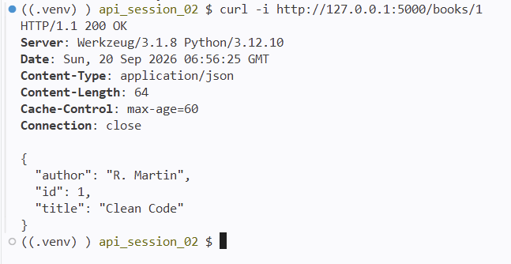

Kết quả test PATCH cập nhật một phần (200 OK):
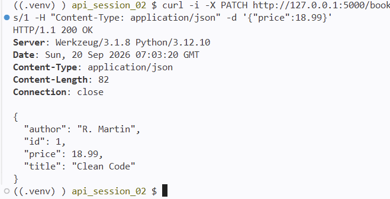

Kiểm tra lại sau khi PATCH:
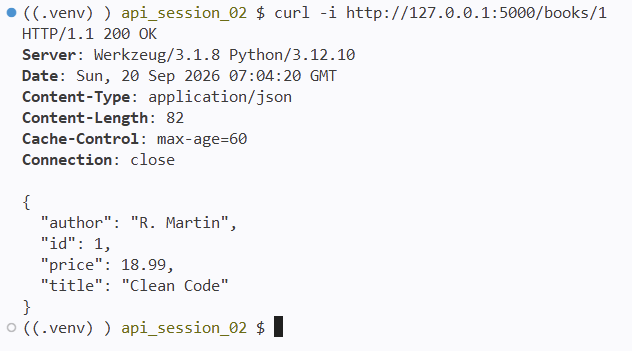

Kết quả test PUT (200 OK):
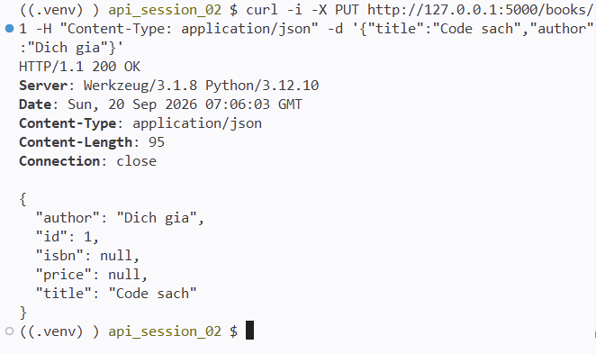

Kết quả test DELETE xoá sách (204 No Content):
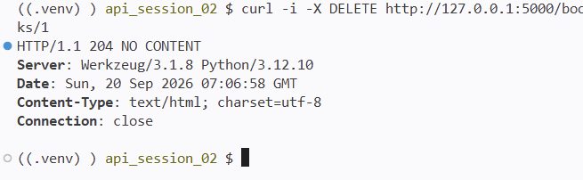

Kết quả test GET không tìm thấy sau khi xoá (404 Not Found):
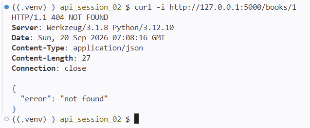

## Bài 3

Kết quả test phân trang trang 1 (page=1&size=2):
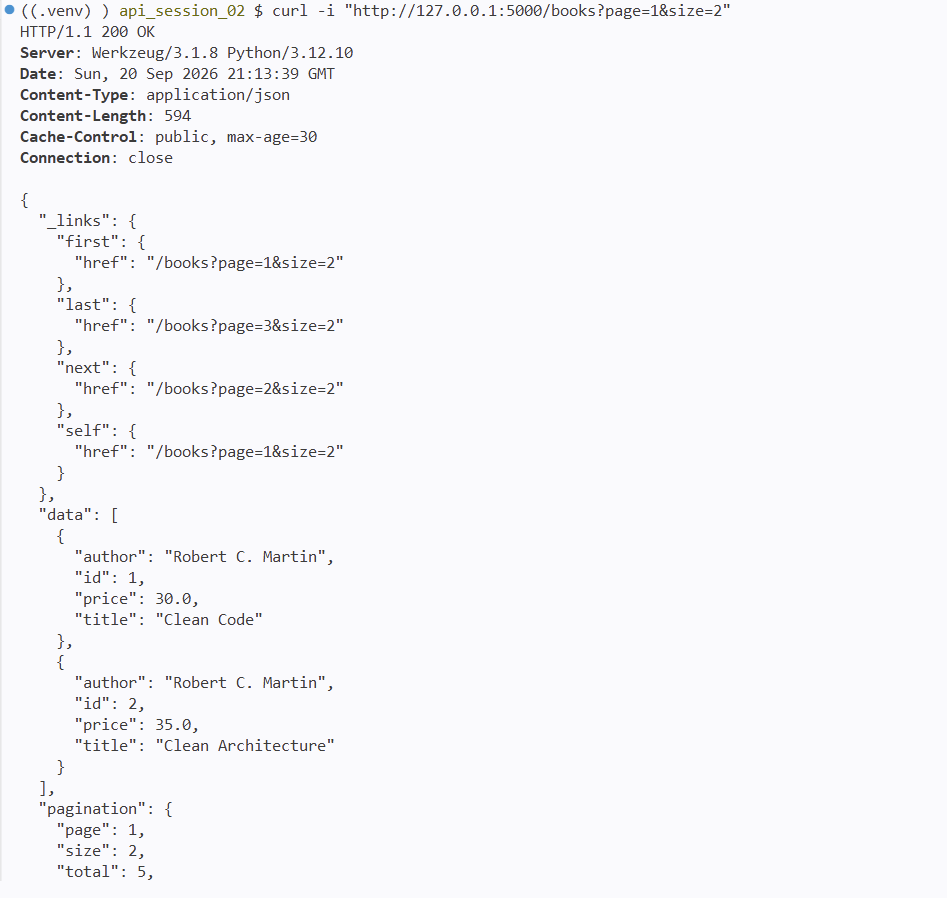

Kết quả test phân trang trang 2 có link prev và next (page=2&size=2):
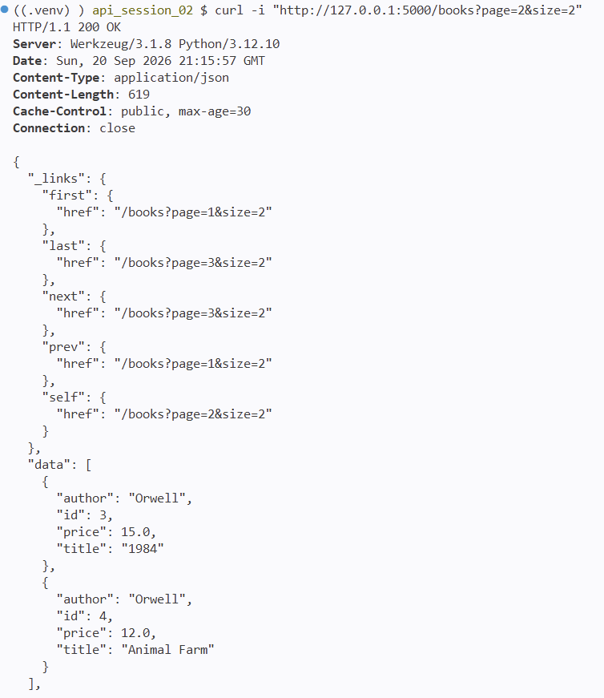

Kết quả test lọc theo tác giả (author=Orwell):
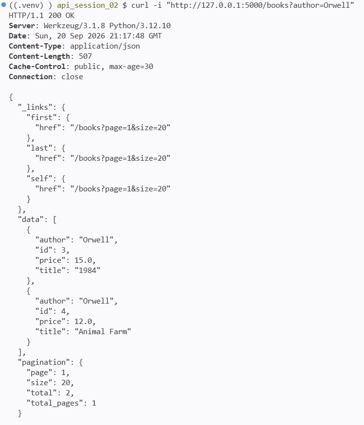

Kết quả test tìm kiếm từ khoá trong tiêu đề (q=clean):
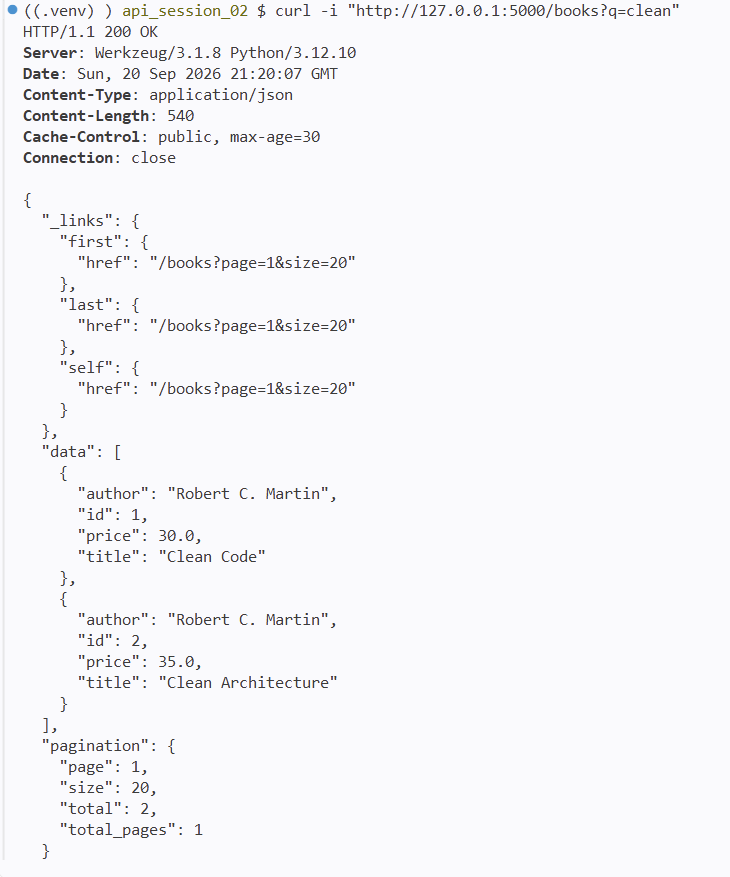

Kết quả test lỗi tham số không phải số nguyên (400 Bad Request):
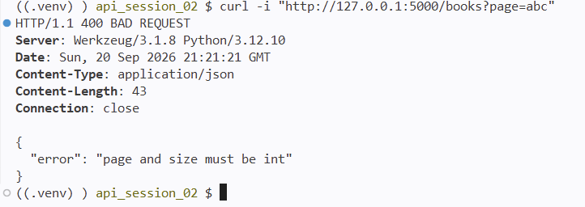

Kết quả test Header Accept application/json (200 OK):
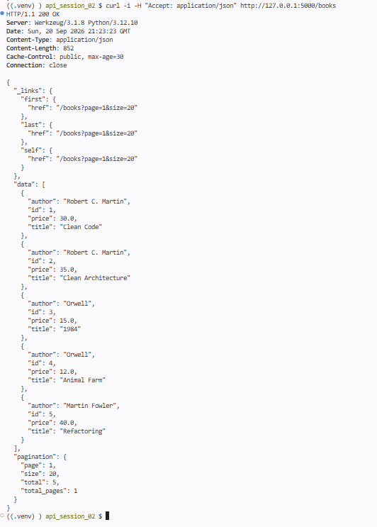