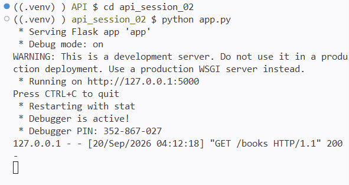
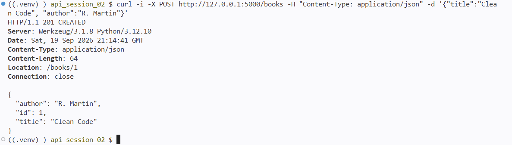
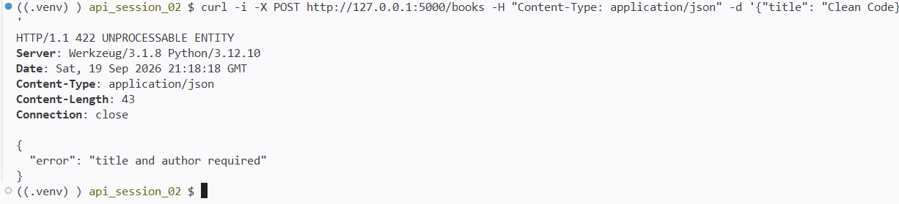
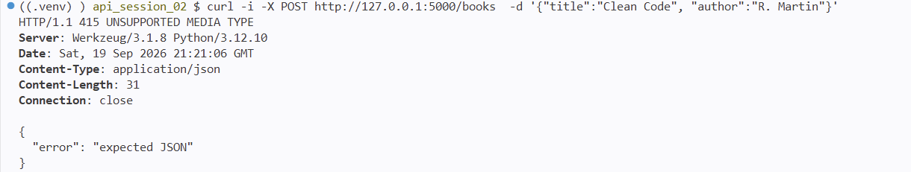
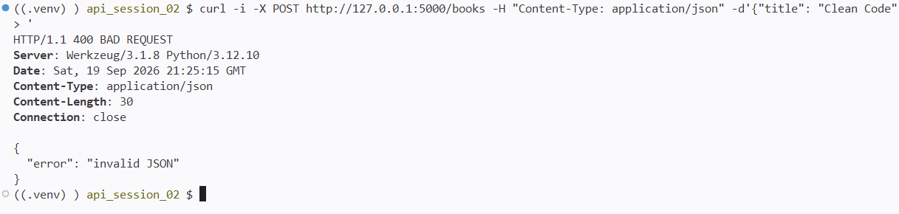

## Bài 1

Chạy server:

Kết quả test tạo mới thành công (201 Created):

Kết quả test lỗi thiếu field (422 Unprocessable Entity):

Kết quả test lỗi thiếu Content-Type (415 Unsupported Media Type):

Kết quả test lỗi sai cú pháp JSON (400 Bad Request):

