## Lab1

Bảng endpoint:

| Endpoint | Method | Dạng |
| --- | --- | --- |
| `/api/v1/users` | GET, POST | Collection |
| `/api/v1/users/{id}` | GET, PATCH | Item |
| `/api/v1/posts` | GET, POST | Collection |
| `/api/v1/posts/{id}` | GET, PUT, PATCH, DELETE | Item |
| `/api/v1/comments` | GET, POST | Collection |
| `/api/v1/comments/{id}` | GET, PATCH, DELETE | Item |
| `/api/v1/tags` | GET, POST | Collection |
| `/api/v1/follows` | GET, POST | Collection |
| `/api/v1/follows/{id}` | DELETE | Item |

Sơ đồ cây endpoint:

Chú thích: nét liền là cấp path (/), nét đứt là query parameter dùng để lọc (?)

Chạy server:
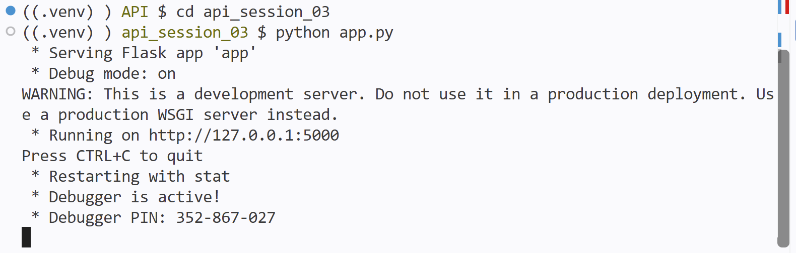

Kết quả test GET danh sách bài viết (200 OK):
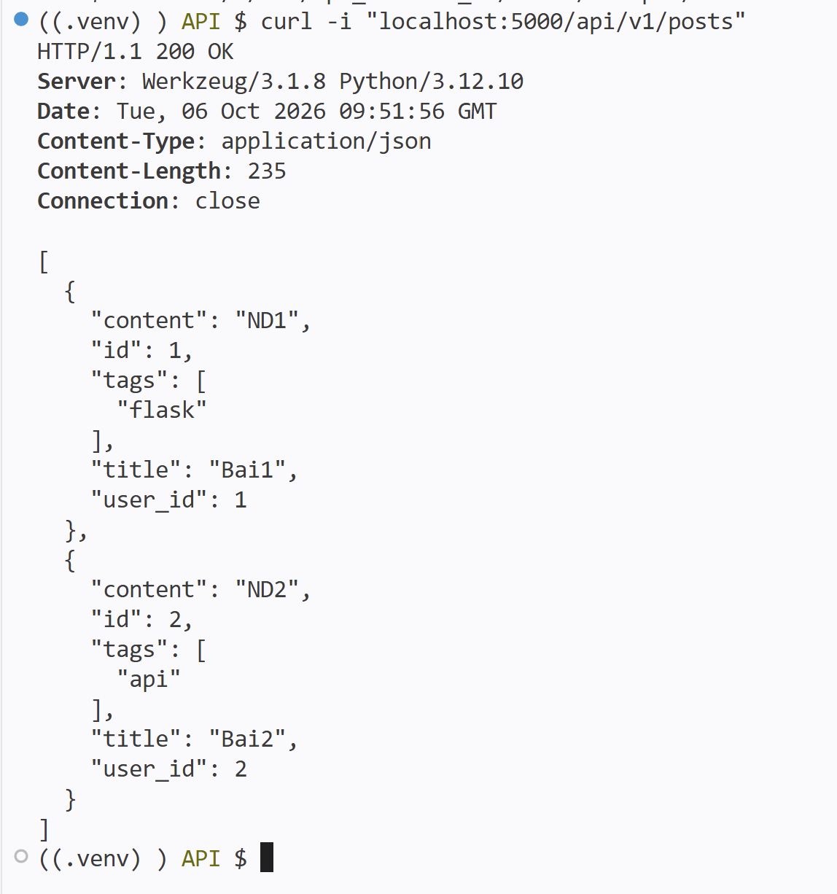

Kết quả test lọc theo user (user_id=1):
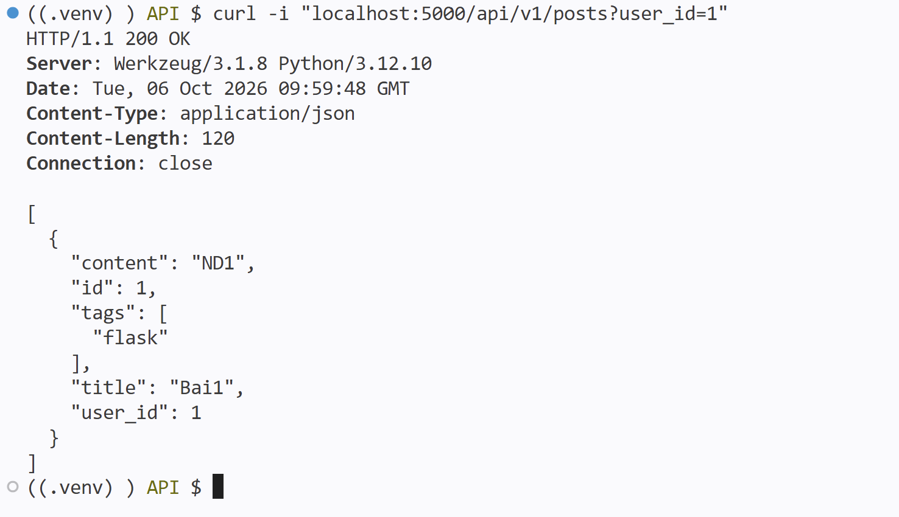

Kết quả test lọc theo tag (tag=api):
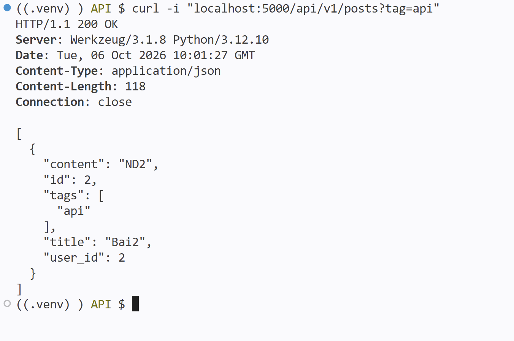

Kết quả test POST tạo mới thành công (201 Created):
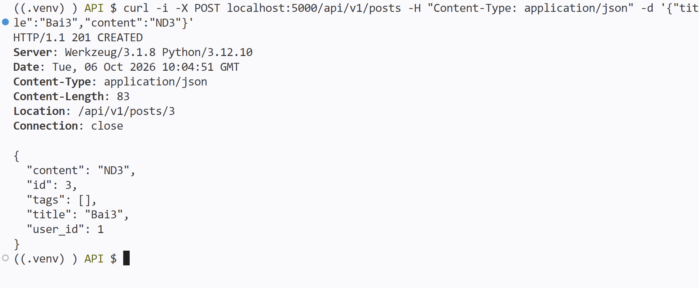

## Lab2

Chạy server:
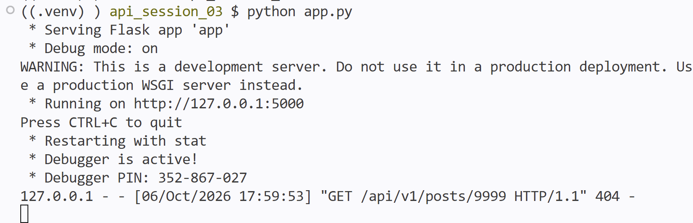

Kết quả test GET bài viết không tồn tại (404 Not Found):
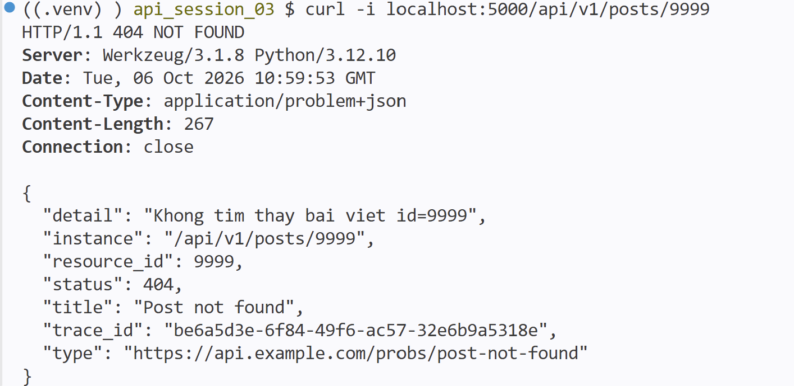

Kết quả test URL không tồn tại (404 Not Found):
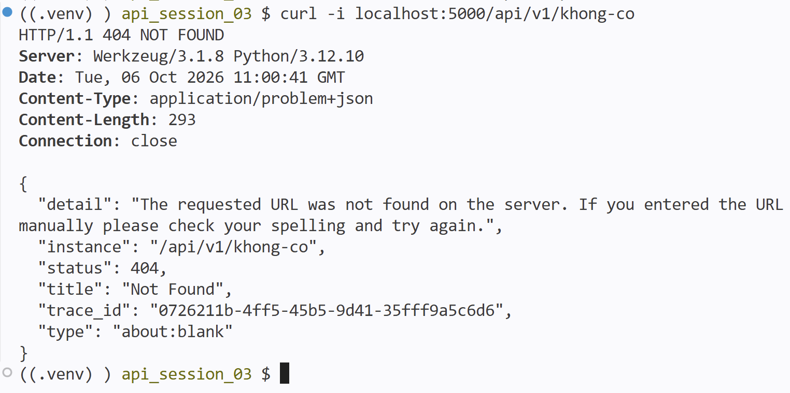

Kết quả test sai method (405 Method Not Allowed):
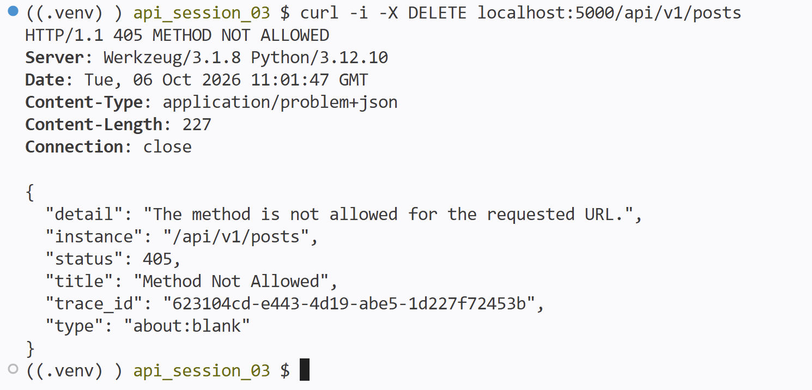

Kết quả test lỗi sai cú pháp JSON (400 Bad Request):
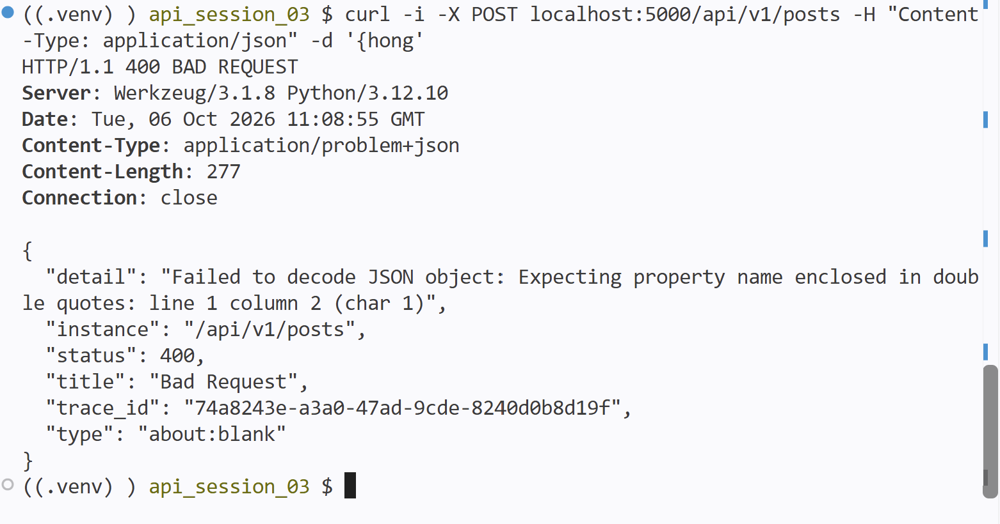

Kết quả test lỗi thiếu field (422 Unprocessable Entity):
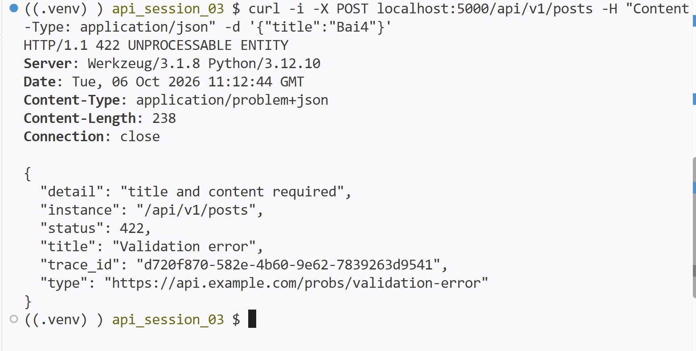

Kết quả test lỗi server (500 Internal Server Error):
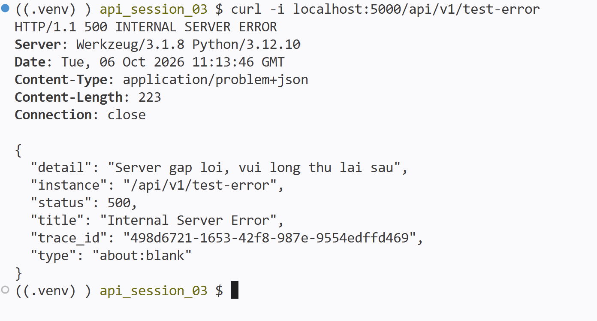
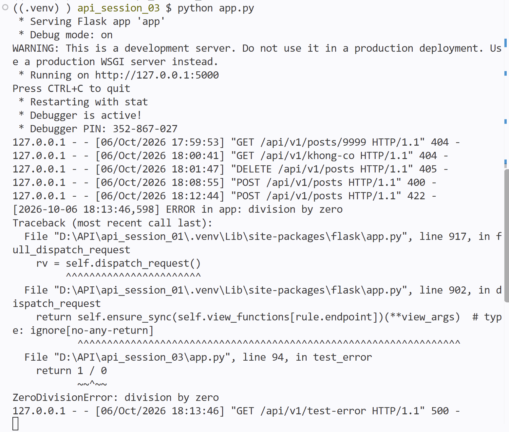